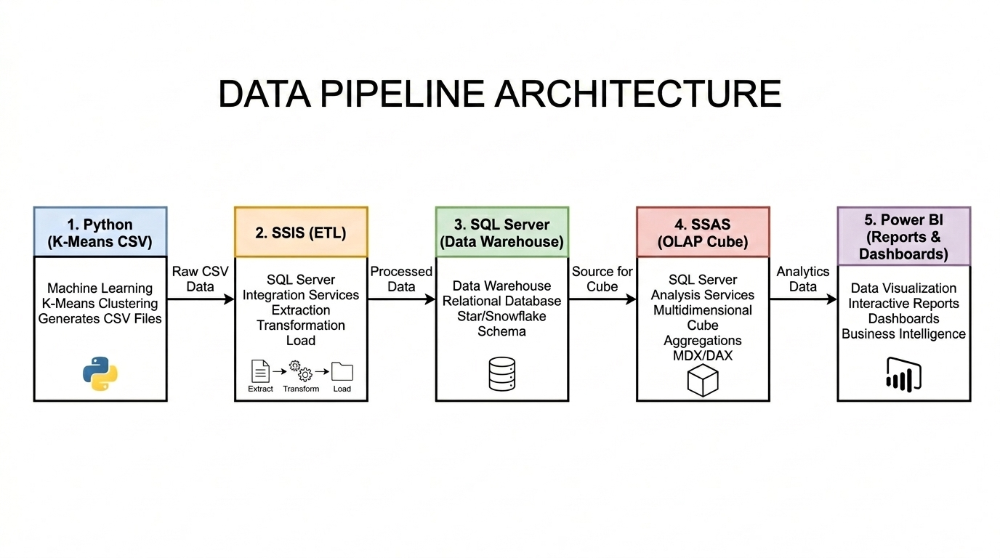

# Shipment Risk Analysis Project - OLAP System

This project focuses on analyzing shipment risk in the supply chain using **Machine Learning (K-Means Clustering)**, building a **Data Warehouse**, **ETL (SSIS)** processes, **OLAP Cube (SSAS)** design, performing multidimensional analysis using **MDX** query language, and visualizing data through reports & dashboards on **Power BI**.

---

## 🗺️ System Process Overview (Workflow)

---

## 📂 Project Directory Structure

Here is a high-level overview of the folders and files in the project:

- 📂 **`ShipmentRisk_FinalProject/`**: The **SSIS (SQL Server Integration Services)** project, responsible for the ETL process—extracting data from CSV, transforming, and loading it into SQL Server.
- 📂 **`ShipmentRisk_FinalProject_SSAS/`**: The **SSAS (SQL Server Analysis Services)** project, responsible for building the multidimensional data model (OLAP Cube) and defining dimensions.
- 📄 **`ShipmentRisk.csv`** & **`ShipmentRisk_with_kmeans_pred.csv`**: The original shipment transaction dataset and the processed dataset appended with the K-Means clustering prediction results.
- 📄 **`Dim.sql`**, **`Trigger.sql`** & **`Test.sql`**: SQL scripts used to create the data warehouse table schema, install automatic deduplication triggers, and facilitate testing cleanups.
- 📄 **`TruyVanMDX.mdx`** & **`TruyVanMDX(ROLLUP,DRILLDOWN,...).mdx`**: Files containing basic and advanced MDX queries (Roll-up, Drill-down, Slice, Dice, Pivot).

---

## 📊 Database Schema

The Data Warehouse is designed using a **Star Schema** defined in [Dim.sql](Dim.sql) and consists of the following tables:

### 1. Dimension Tables

- **`DimDate`**: Time dimension (Date, Day, Month, Year, Quarter, Day of Week).
- **`DimBuyer`**: Buyer information (Buyer ID, Dominant Buyer Flag, Data Sharing Consent, Available Historical Records).
- **`DimSupplier`**: Supplier information (Supplier ID, Supplier Reliability Score, Historical Disruption Count).
- **`DimProductCategory`**: Product category (Textiles, Machinery, Food, Pharma, etc.).
- **`DimShippingMode`**: Shipping method (Road, Rail, Sea, Air).
- **`DimDisruption`**: Disruption event details (Disruption Type, Disruption Severity).
- **`DimOrganization`**: Organization / Entity details.

### 2. Fact Table

- **`FactShipment`**: Connected to all dimensions via foreign keys. The date dimension acts as multiple Role-Playing Dimensions: `OrderDateKey` (Order Date), `DispatchDateKey` (Dispatch Date), and `DeliveryDateKey` (Delivery Date).
- **Measures**:
  - `Quantity_Ordered`: Ordered item quantity.
  - `Order_Value_USD`: Total order value in USD.
  - `Delay_Days`: Number of shipment delay days.
  - `Federated_Round`: Number of federated learning training rounds (Federated Learning metric).
  - `Parameter_Change_Magnitude`: Magnitude of model parameter changes.
  - `Communication_Cost_MB`: Communication overhead in MB.
  - `Energy_Consumption_Joules`: Power usage in Joules.
  - `Supply_Risk_Flag`: Actual supply chain risk flag.

---

## 🔄 ETL Process & Deduplication (SSIS)

To optimally transform and load data from CSV files into the SQL Server data warehouse, the project implements:

1. **ETL Process in SSIS**: Extracts data from CSV files, reformats date/numeric fields, and loads it into the SQL Server database.
2. **Deduplication Mechanism using Triggers**:
   - Employs `INSTEAD OF INSERT` triggers on all Dimension and Fact tables.
   - When the ETL process attempts to insert a new row, the trigger checks if the identifier data (e.g., Buyer ID, Supplier ID, Date Key...) already exists. If it does, the new record is ignored, ensuring data integrity and preventing duplicate records across multiple ETL runs (Idempotency).

---

## 🧭 OLAP Cube Design (SSAS)

The project establishes a Multidimensional OLAP Cube based on a Data Source View connecting directly to the SQL Server data warehouse:

- **Data Integration**: Maps foreign keys in the Fact table to primary keys in their corresponding Dimension tables.
- **Time Dimension Hierarchy**: Defines a clear time hierarchy (Year ➔ Quarter ➔ Month ➔ Day) to support time-series analysis.
- **Analysis Dimensions**: Incorporates characteristic attributes supporting filtering and analysis, such as supplier reliability score and buyer consent status.

---

## 🔍 Analytical Queries with MDX

The project provides two template MDX query files to run in SSMS to extract business insights:

### 1. Basic Analysis ([TruyVanMDX.mdx](TruyVanMDX.mdx))

- Calculate the average communication cost by shipping mode.
- Calculate the total order value by buyer.
- Retrieve the **Top 5** suppliers with the highest shipment delay days (`Delay_Days`).
- Calculate the total energy consumption during model training by product category.
- Rank suppliers based on their total ordered quantities.

### 2. Advanced OLAP Operations ([TruyVanMDX(ROLLUP,DRILLDOWN,...).mdx](<TruyVanMDX(ROLLUP,DRILLDOWN,...).mdx>))

- **Roll-up**: Aggregate total order value up to the Year level.
- **Drill-down**: Navigate from the Year level down to the detail Date Key level.
- **Slice**: Filter transaction data specifically for a single buyer or shipping mode.
- **Dice**: Filter concurrently across multiple dimensions (e.g., restricting to buyer `B801`, supplier `S510` in specific years).
- **Pivot**: Pivot the visualization grid (e.g., displaying Suppliers as columns and Buyers as rows).

---

## 🚀 Deployment & Usage Guide

### Step 1: Database Setup

1. Open **SQL Server Management Studio (SSMS)** and connect to your Database Engine.
2. Open and **Execute** the [Dim.sql](file:///D:/OLAP/ShipmentRisk/Dim.sql) script to create the `DOAN1` database and the tables.
3. Open and **Execute** the [Trigger.sql](file:///D:/OLAP/ShipmentRisk/Trigger.sql) script to set up deduplication triggers.

### Step 2: Run the ETL Process (SSIS)

1. Install the **Integration Services Projects** extension in Visual Studio.
2. Open your SSIS project.
3. Configure the Flat File Connection Manager source path to point to your CSV file (either the raw or K-Means version) and configure the Destination Connection to point to your SQL Server.
4. Execute the SSIS package to start the extract, transform, and load process.

### Step 3: Deploy the OLAP Cube (SSAS)

1. Install the **Analysis Services Projects** extension in Visual Studio.
2. Open your SSAS project.
3. Update the Data Source connection string to point to the SQL Server database loaded in Step 2.
4. Right-click the SSAS project and select **Deploy** to compile, build, and publish the Cube to your SQL Server Analysis Services instance.

### Step 4: Run Analytical Queries (MDX)

1. Connect to **Analysis Services** (SSAS) in SSMS.
2. Open a new MDX Query window targetting the deployed Cube.
3. Copy the queries from the MDX template files ([TruyVanMDX.mdx](TruyVanMDX.mdx) or [TruyVanMDX(ROLLUP,DRILLDOWN,...).mdx](<TruyVanMDX(ROLLUP,DRILLDOWN,...).mdx>)) and press **Execute** to view results.

### Step 5: Visualize on Dashboard (Power BI)

1. Open **Power BI Desktop**.
2. Select **Get Data** -> **Database** -> **SQL Server Analysis Services database**.
3. Enter your SSAS server address and select the deployed database/Cube.
4. Build interactive reports and dashboards for supply chain shipment risk analysis using the dimensions and measures defined in the Cube.
